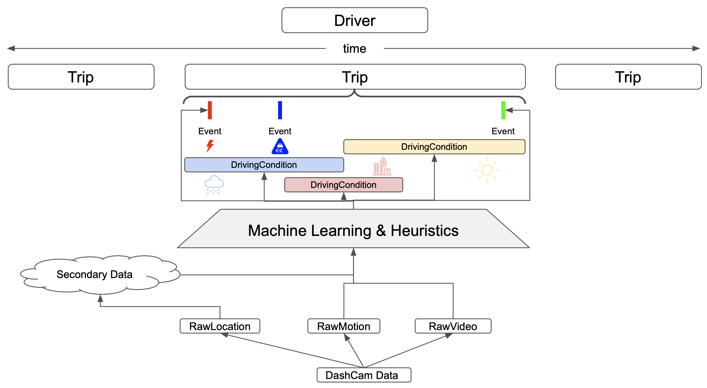

# seneca

## About
Seneca's mission ~is~ was to bridge the gap between data gathered on-vehicle and auto insurance companies that want to use that data to adjust risk assessments.  See how far we made it [here](https://drive.google.com/file/d/1GCUXTPHJAVLlRRTtW8tI8w4Vr7t1zgP1/view?usp=sharing).

Seneca.AI/seneca implements all of the infrastucture for this application, aside from Python ML models and a React client.

### Architecture

#### Code Locations
* ID001: [internal/client/googledrive](https://github.com/Seneca-AI/seneca/tree/main/internal/client/googledrive)
* ID002: [internal/controller/syncer](https://github.com/Seneca-AI/seneca/tree/main/internal/controller/syncer)
* ID003: [internal/dataaggregator](https://github.com/Seneca-AI/seneca/tree/main/internal/datagatherer/rawvideohandler)
* ID004: [internal/controller/runner](https://github.com/Seneca-AI/seneca/tree/main/internal/controller/runner)
* ID005: [internal/dataprocessor](https://github.com/Seneca-AI/seneca/tree/main/internal/dataprocessor)
* ID006: https://github.com/Seneca-AI/ML
* ID007: [internal/dataagreggator](https://github.com/Seneca-AI/seneca/tree/main/internal/dataaggregator/sanitizer)
* ID008: [internal/controller/apiserver](https://github.com/Seneca-AI/seneca/tree/main/internal/controller/apiserver)
* ID009: https://github.com/Seneca-AI/client

### Data Model
The data model is defined at https://github.com/Seneca-AI/common/tree/main/api/type

#### Some other notable points

* This repo is a WIP that is no longer in progress and needs a lot of work.
* All projects under Seneca-AI run GitHub Actions by first copying protos from the 'common' repo and compiling them within the action.
* Integration tests, which run on pushes to staging/main can be found at [test/integrationtest](https://github.com/Seneca-AI/seneca/tree/main/test/integrationtest).  The server that runs these tests can be found at [devops/itestserver](https://github.com/Seneca-AI/seneca/tree/main/devops/itestserver).
* When new code is pushed to main, [devops/coreserver/helpers/pusher.go](https://github.com/Seneca-AI/seneca/blob/main/devops/coreserver/helpers/pusher.go) pushes it to the server.
* If a server isn't responding to heartbeat requests, [devops/coreserver/helpers/medic.go](https://github.com/Seneca-AI/seneca/blob/main/devops/coreserver/helpers/medic.go) will restart it.

## Dev Info

### Rules
* New PR's are merged into staging

### Helpful Commands
* Run all tests (from root repo directory)
    * `$ go test ./...`
* Run the linter
    * `$ golangci-lint run`

### Requirements
* [Exiftool](https://exiftool.org/install.html#Unix) must be installed on the server
* [Protoc](https://grpc.io/docs/protoc-installation/)

### Tools
* [golangci-lint](https://golangci-lint.run/usage/install/#local-installation)

## Setup

### Setup from a fresh VM
1. Get the repository
    1. `$ sudo apt-get install git -y`
    1. `$ git clone https://github.com/Seneca-AI/seneca.git`
    1. `$ cd seneca`
1. Run the setup script
    1. `$ bash setup.sh setup`

### Open up VM port for external traffic
1. `$ bash setup.sh open_port`

### Start the server
1. `$ bash setup.sh start_singleserver`
