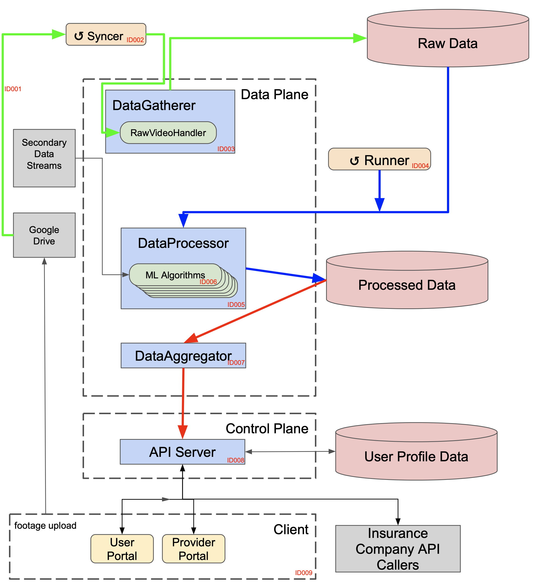

# seneca

## About
Seneca's mission is to bridge the gap between data gathered on-vehicle and auto insurance companies that want to use that data to adjust risk assessments.

Seneca.AI/seneca implements all of the infrastucture for this application, aside from Python ML models and a React client.

### Architecture

#### Code Locations
* ID001: internal/datagatherer
* ID002: internal/controller/syncer
* ID003: internal/dataaggregator

## Dev Info

### Rules
* New PR's are merged into staging

### Helpful Commands
* Run all tests (from root repo directory)
    * `$ go test ./...`
* Run the linter
    * `$ golangci-lint run`

### Requirements
* [Exiftool](https://exiftool.org/install.html#Unix) must be installed on the server
* [Protoc](https://grpc.io/docs/protoc-installation/)

### Tools
* [golangci-lint](https://golangci-lint.run/usage/install/#local-installation)

## Setup

### Setup from a fresh VM
1. Get the repository
    1. `$ sudo apt-get install git -y`
    1. `$ git clone https://github.com/Seneca-AI/seneca.git`
    1. `$ cd seneca`
1. Run the setup script
    1. `$ bash setup.sh setup`

### Open up VM port for external traffic
1. `$ bash setup.sh open_port`

### Start the datagatherer server
1. `$ bash setup.sh start_datagatherer`
